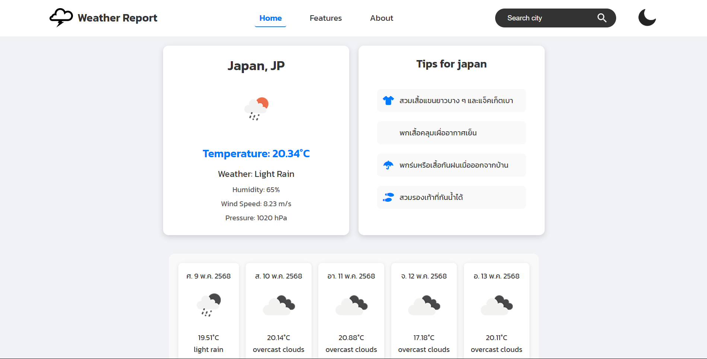

# 🌦️ Weather Report App

A responsive weather forecast web application that provides real-time weather data for cities worldwide using the OpenWeather API.

---
## 📷 Screenshots

### Homepage

---
## 🚀 Features

- Search weather by city name
- Real-time current weather data
- Temperature, humidity, wind speed
- Light / Dark mode
- Responsive design
- Weather suggestions based on conditions
- Clean and modern UI

---

## 💻 Tech Stack

- React
- JavaScript
- CSS3
- OpenWeather API

---

## 🌐 Live Demo

🔗 https://weather-app-teera.netlify.app/

---

## 🎯 Purpose of This Project

This project was created to improve my frontend development skills and API integration experience.

---

## 👨‍💻 Author

Teerapong Homchuen
